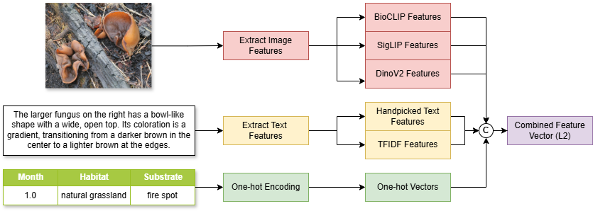

# Mushroom for Improvement: Prototypical Few-Shot Learning with Multimodal Fungal Features

## Abstract

We propose a multimodal few-shot classification pipeline for the **FungiCLEF 2025** challenge, targeting fine-grained fungal species identification from sparse, heterogeneous observations. Our method fuses visual features extracted from three pretrained encoders—**BioCLIP**, **SigLIP ViT-B/16**, and **DINOv2**—with textual descriptions and structured metadata to form a unified multimodal representation.

The model is trained in two stages:

1. **Supervised pretraining** of a multimodal encoder.
2. **Episodic fine-tuning** with a prototypical network under few-shot conditions.

At inference time, we apply **observation-level reranking** using a weighted voting strategy across multiple images per observation.

Evaluation on the official public and private test splits of FungiCLEF 2025 shows robust performance, achieving **Recall\@5** scores of **0.57079** and **0.55498**, respectively. Ablation studies highlight the complementary value of combining image, text, and metadata modalities.

---

|  |
| :----------------------------------------------------------: |
|           *Multimodal feature extraction pipeline.*          |

|  |
| :-----------------------------------------------: |
|    *Training and prediction pipeline overview.*   |

---

## Dataset

You can access the dataset from the official competition page:
[FungiCLEF 2025 @ CVPR-FGVC & LifeCLEF](https://www.kaggle.com/competitions/fungi-clef-2025/data)

After downloading the data, update the `data_path` variable in [the notebook](./fungiclef25.ipynb) to point to your local dataset directory. The default setup supports execution directly within Kaggle notebooks.

---

## Installation

Set up a Python virtual environment and install the required dependencies.

<details>
<summary><strong>Linux / macOS</strong></summary>

```bash
python -m venv .venv
source .venv/bin/activate
pip install -r requirements.txt
```

</details>

<details>
<summary><strong>Windows</strong></summary>

```cmd
python -m venv .venv
.venv\Scripts\activate
pip install -r requirements.txt
```

</details>

---

## Results

### Recall\@5 Using Pretrained Models with Varying Modalities

| **Feature Type**                  | **Public Split** | **Private Split** |
| --------------------------------- | ---------------- | ----------------- |
| BioCLIP only (baseline)           | 0.33185          | 0.26649           |
| Image $\times$ 3 | 0.30973          | 0.30012           |
| + Text                      | 0.44690          | 0.44243           |
| + Metadata                  | 0.46902          | 0.45795           |
| **All (I+T+M)** | **0.46460**      | **0.46183**       |

### Recall\@5 from Full Pipeline

| **Model Configuration**         | **Public Split** | **Private Split** |
| ------------------------------- | ---------------- | ----------------- |
| Pretrained (fused features)     | 0.46460          | 0.46183           |
| Trained (supervised + episodic) | 0.53539          | 0.50711           |
| **Reranked Ensemble**           | **0.57079**      | **0.55498**       |

---
